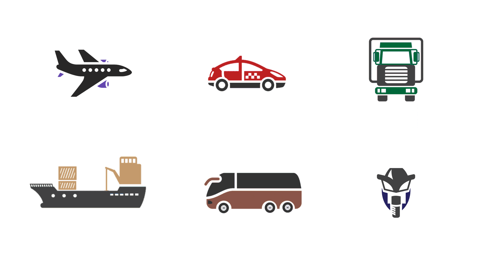
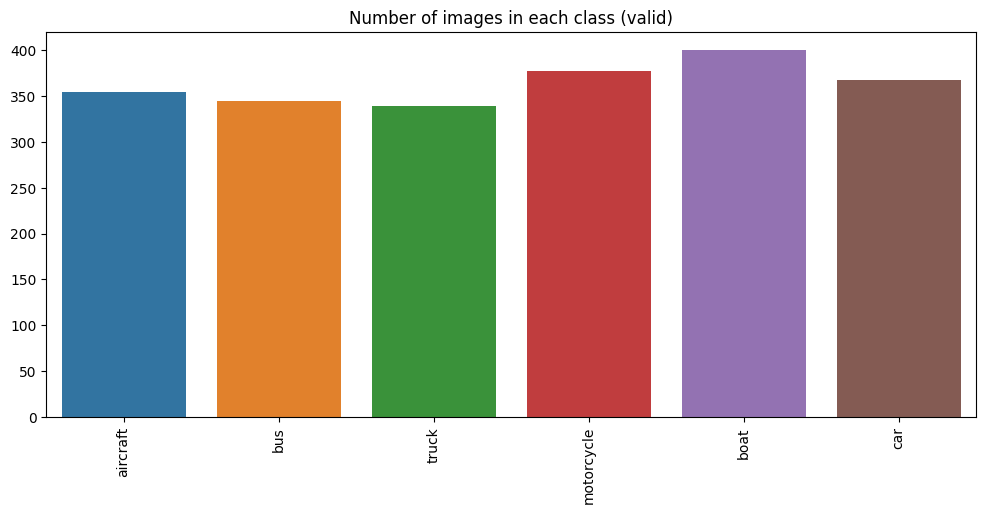
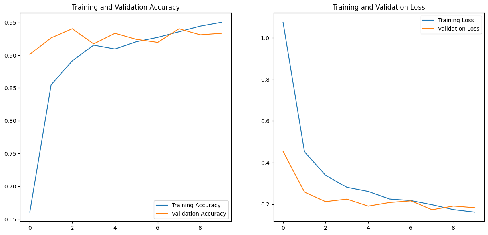

# Vehicle Multi-class Classification

## Data Distribution

## Data
Over 2,000 images of vehicles from 6 different classes. These classes are mainly Boat, Bus, Car, Aircraft, Truck and Motorcycle . Images were scraped from google images.
The dataset has also been uploaded on kaggle.

Link : https://www.kaggle.com/datasets/kunalmadan/vehicle-multi-classification

## Performance

## Model
The model used in this project is based on the InceptionV3 architecture, pre-trained on the ImageNet dataset.
The model consists of a base model with frozen layers and additional layers on top for classification.

## Accuracy
It achieved a test accuracy of 94%.
