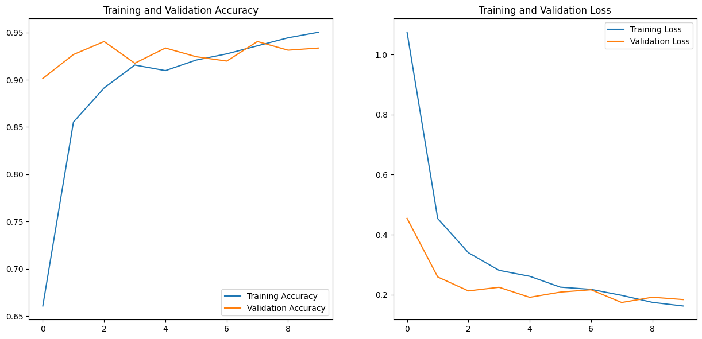

# Vehicle Multi-class Classification

## Data Distribution

## Data
Over 2,000 images of vehicles from 6 different classes. These classes are mainly Boat, Bus, Car, Aircraft, Truck and Motorcycle . Images were scraped from google images.
The dataset has also been uploaded on kaggle.

Link : https://www.kaggle.com/datasets/kunalmadan/vehicle-multi-classification

## Performance

## Model
The models used in this project are Local Model, EfficientNetV2B0 Model, MobileNet Model, MobileNetV2 Model, VGG16 Model and InceptionV3 Model.
Their performances are : 
| Model                  | Accuracy   | Loss     |
|------------------------|------------|----------|
| Local Model            | 0.461187   | 1.42911  |
| EfficientNetV2B0 Model | 0.246575   | 1.77426  |
| MobileNet Model        | 0.917808   | 0.191116 |
| MobileNetV2 Model      | 0.954338   | 0.1597   |
| VGG16 Model            | 0.789954   | 0.652238 |
| InceptionV3 Model      | 0.899543   | 0.250821 |

MobileNetV2 Model showed the maximum accuracy and the minimum loss.

## Accuracy
Achieved a test accuracy of **95.43%**.
